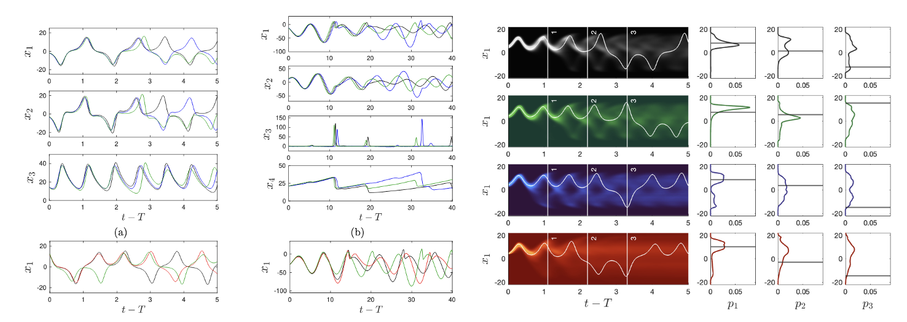
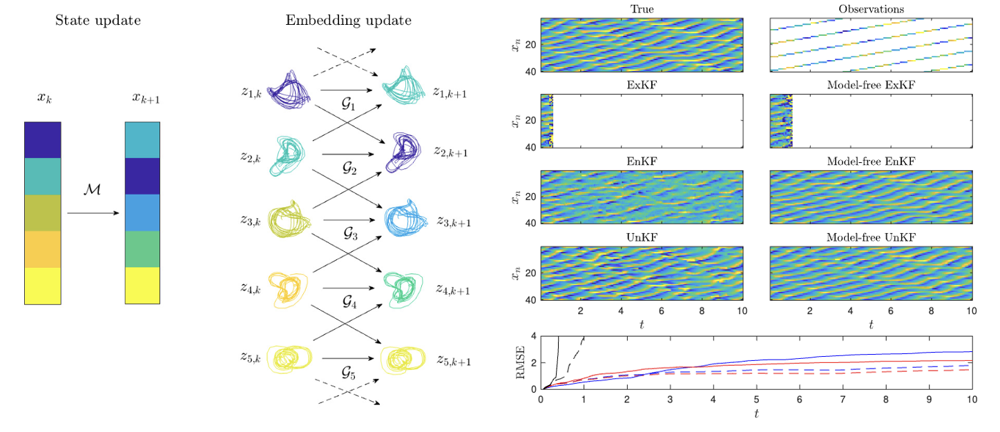
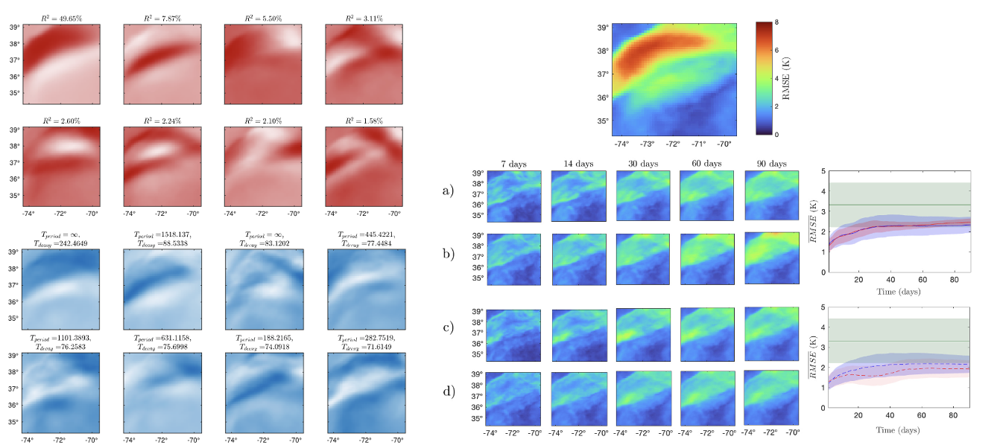



Most of my work relies on using properties of certain dynamical systems to be able to reconstruct their dynamics from partially observed data. Namely, Takens Embedding Theorem allows certain attractors from chaotic dynamical systems to be reconstructed using what is known as a *delay embedding*. This enables chaotic dynamics to be estimated directly from observational data, potentially at higher accuracy than models derived from other means such as first-principles modelling. The subsections below were the titles of my chapters of my PhD thesis which provide a summary of my research.

Reconstruction for prediction 
------
The vector field in a local neighbourhood around a chaotic attractor may be estimated from observational data using optimal control, from which, prediction and uncertainty quantification can be facilitated without a model of the system. Even when only partial observations of the full state are available, Takens Embedding Theorem allows estimation of the system dynamics. The paper [Optimal Reconstruction of Vector Fields from Data for Prediction and Uncertainty Quantification](https://dankesean.github.io/publication/2024-06-13-optimal-vec-fields) arose from this research.

$$\mathbf{x}(t+T) = \mathbf{x}(t)+\int^{t+T}_{t} \mathbf{g}(\mathbf{x}(\tau)) \, \mathrm{d} t $$

Reconstruction for estimation 
------
Using a similar idea, filtering algorithms that rely on accurate models for data assimilation may be adapted into model-free settings to avoid the negative effects of model imperfection. Rather than performing data assimilation in the observation space, my research explored how this could be facilitated in the embedded space which results in a more robust method of model-free data assimilation.

$$\mathbf{x}^f_{k} = \mathcal{M}_{k}\bigl(\mathbf{x}^a_{k-1}\bigr) $$

$$\mathbf{x}^a = \mathbf{x}^f_k+\mathbf{K}_k\left(\mathbf{y}_k-\mathcal{H}_k\bigl(\mathbf{x}^f_k \bigr)\right) $$

Reconstruction for correction 
------
Knowledge-based models are of great importance due to their mechanistic understanding and reliability however, they often fail to incorporate dynamics on all temporal and spatial scales. Using data-driven methods that allow modal decompositions of spatiotemporal dynamics, this research investigated how the dynamically evolving bias between a model and observations may be predicted and used to correct imperfect models during uninitialised projections.

$$\mathbf{x}(t+T) \approx \mathbf{x}^\mathcal{M}(t+T)+\mathcal{D}^T(\mathbf{e}(t)) $$

